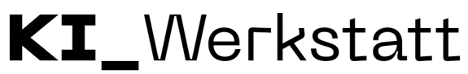

 

# Gen-AI-Use-Case-Maps
Sammlung von GenAI Use Cases nach Branche.

## Mehr Infos
Details zu Projekten und Kontaktmöglichkeiten finden sich auf der Seite der [KI Werkstatt](https://kiwerkstatt.f2.htw-berlin.de/).
Die Arbeiten an diesen Dokumenten wurden finanziert durch die Förderprojekte [GenAI in KMU](https://www.htw-berlin.de/forschung/online-forschungskatalog/projekte/projekt?eid=3495) und [BerGPT](https://www.htw-berlin.de/forschung/online-forschungskatalog/projekte/projekt?eid=3487).

## Lizenz
Die vorliegenden Inhalte sind frei verfügbar unter einer CC BY-SA 4.0 Lizenz.
